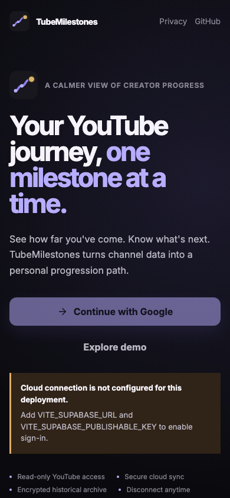
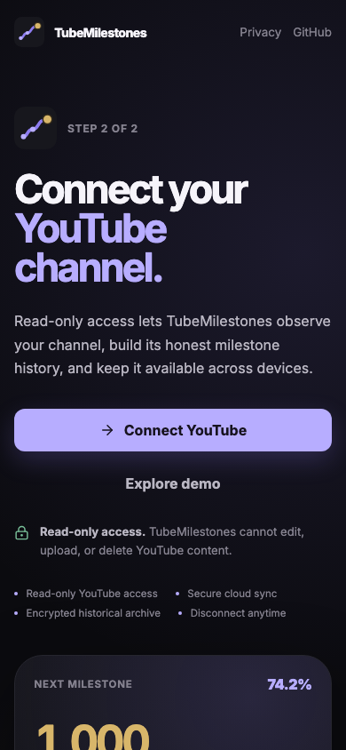
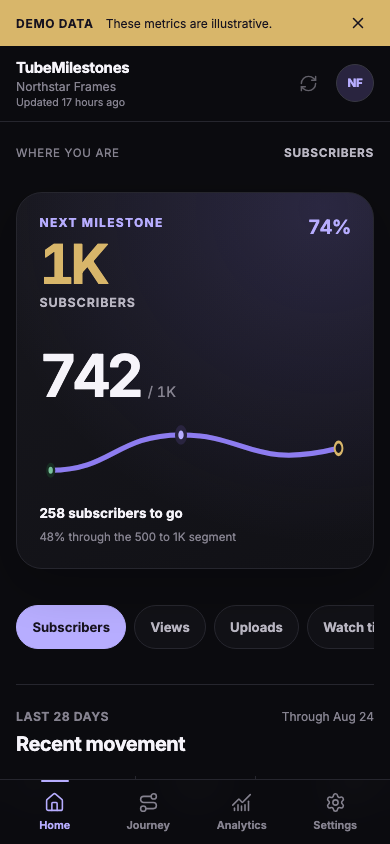
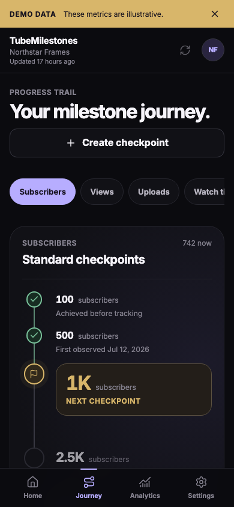
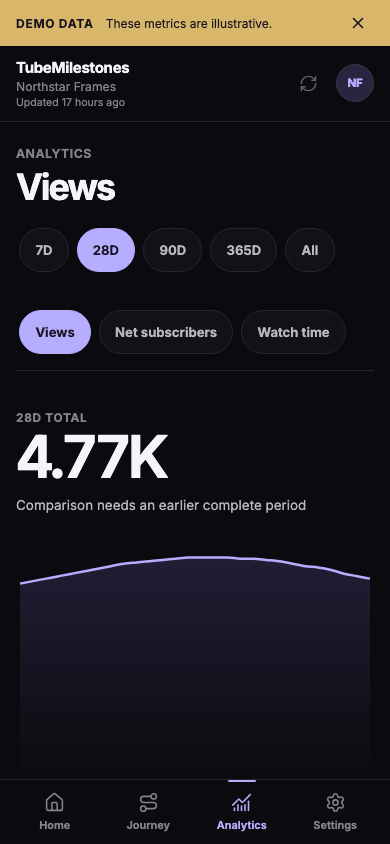
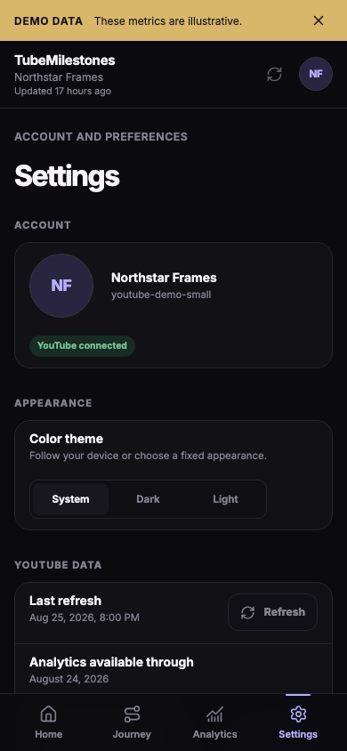
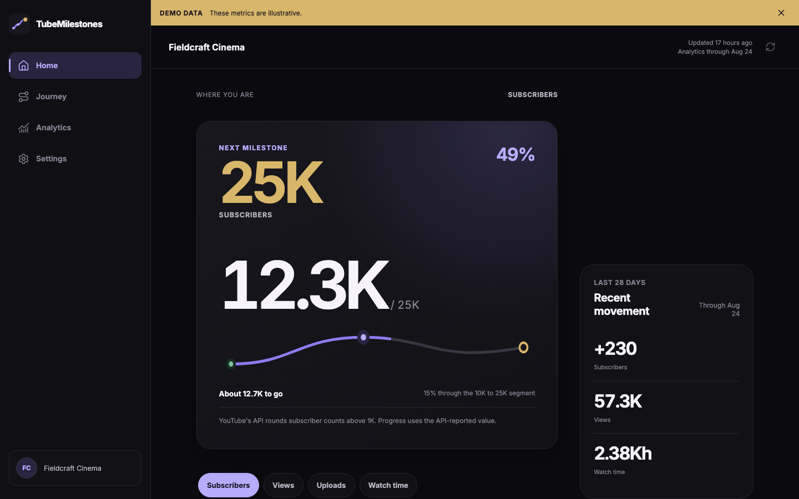

<p align="center">
  
</p>

<h1 align="center">TubeMilestones</h1>

<p align="center">
  A calm, milestone-first companion for YouTube creators.<br />
  Know where you stand, what comes next, and what you have already achieved.
</p>

TubeMilestones is a mobile-first React application that turns authorized YouTube channel
statistics into an honest personal progression path. GitHub Pages serves only the UI;
Supabase owns identity, server-side YouTube access, hot data, and trusted workflows;
encrypted older history lives in a private Cloudflare R2 bucket.

## Product

- One dominant next-checkpoint view for subscribers, views, uploads, and watch time
- Honest history: pre-existing achievements never receive invented completion dates
- A differentiated vertical Journey with standard and user-created checkpoints
- 7D, 28D, and 90D hot Analytics plus transparently merged 365D and all-time history
- Hidden and rounded subscriber semantics that match YouTube API precision
- Clearly labeled, user-entered YouTube Partner Program guidance values
- System, premium dark, and intentional warm-light appearance modes
- Separate Google application sign-in and read-only YouTube authorization
- Disconnect, account deletion, authorization revalidation, and retryable purge workflows

## Screenshots

| Landing                                                   | Connect YouTube                                                      | Home                                                |
| --------------------------------------------------------- | -------------------------------------------------------------------- | --------------------------------------------------- |
|  |  |  |

| Journey                                                   | Analytics                                                     | Settings                                                    |
| --------------------------------------------------------- | ------------------------------------------------------------- | ----------------------------------------------------------- |
|  |  |  |



Screenshots use visibly labeled fixtures. Production builds do not enable fixture data
unless `VITE_ENABLE_DEMO=true` is deliberately supplied.

## Architecture

```text
GitHub Pages browser ── Supabase JWT ──> Supabase Auth + Postgres + RLS
                                             │
                                             ├── Edge Functions ──> Google / YouTube
                                             │          │
                                             │          └── refresh token in Vault
                                             │
                                             └── 120-day hot history
                                                        │ encrypted monthly archive
                                                        v
                                                 private Cloudflare R2
```

The browser never receives the Google YouTube refresh token, Google client secret, R2
credentials, archive master key, or a Supabase elevated key. R2 is never called directly
from frontend code. GitHub remains source control and does not store user analytics.

Read [Architecture](docs/ARCHITECTURE.md), [Security](docs/SECURITY.md), and the
[API and data policy](docs/API_AND_DATA_POLICY.md) for the complete boundaries.

## Technology

- React 19, TypeScript, Vite, HashRouter, Recharts, and Lucide
- Supabase Auth, Postgres, RLS, Edge Functions, Vault, and Cron
- TanStack Query for browser server state
- Cloudflare R2 using its private S3-compatible API from Edge Functions
- AES-256-GCM, HKDF-SHA-256, and gzip for cold archives
- Vitest, Testing Library, Deno checks, Supabase CLI, and Playwright
- GitHub Actions and GitHub Pages

## Local development

Requirements: Node.js matching `package.json`, npm, and Docker only when running the
local Supabase database.

```bash
git clone https://github.com/StealthMoud/TubeMilestones.git
cd TubeMilestones
npm ci
cp .env.example .env.local
npm run dev
```

Frontend variables:

```dotenv
VITE_SUPABASE_URL=https://YOUR_PROJECT.supabase.co
VITE_SUPABASE_PUBLISHABLE_KEY=sb_publishable_YOUR_KEY
VITE_ENABLE_DEMO=false
```

Only the URL and publishable key belong in a production frontend. Real Google, R2,
archive, and elevated Supabase credentials are Supabase Edge Function secrets. See
[Supabase setup](docs/SUPABASE_SETUP.md), [Google setup](docs/GOOGLE_OAUTH_SETUP.md),
and [R2 setup](docs/R2_SETUP.md).

For fixture-only visual work in development:

```text
http://localhost:5173/#/?demo=small
http://localhost:5173/#/analytics?demo=archive
http://localhost:5173/#/analytics?demo=archive-partial
```

## Commands

```bash
npm run dev             # Vite development server
npm run build           # strict TypeScript plus production Vite build
npm run lint            # frontend and test ESLint
npm run typecheck       # strict frontend TypeScript check
npm run test            # unit, component, backend, storage, and security tests
npm run test:e2e        # mobile matrix and desktop browser QA
npm run backend:lint    # Deno lint for Edge Functions
npm run backend:check   # Deno typecheck for every Edge entrypoint
npm run db:lint         # lint a running local Supabase database
npm run format:check    # Prettier verification
```

## Deployment and operations

The Pages workflow builds `main` with only `VITE_SUPABASE_URL` and
`VITE_SUPABASE_PUBLISHABLE_KEY`, uploads `dist`, and deploys through the
`github-pages` environment. Backend deployment and provider configuration are deliberate
owner actions, documented in [Deployment](docs/DEPLOYMENT.md) and
[Production readiness](docs/PRODUCTION_READINESS.md).

TubeMilestones is independent and is not affiliated with or endorsed by YouTube or
Google. YouTube Studio remains authoritative for official data, platform actions, and
YouTube Partner Program eligibility.
