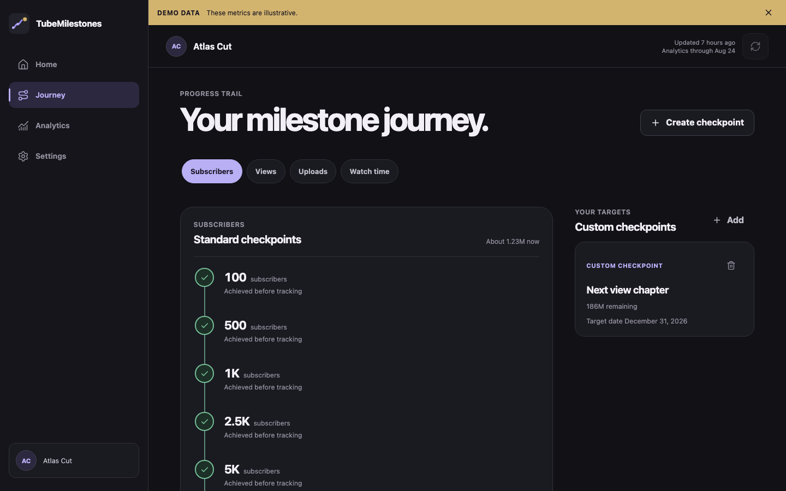

<p align="center">
  
</p>

<h1 align="center">TubeMilestones</h1>

<p align="center">
  A milestone-first companion for YouTube creators.<br />
  Know where you stand, what comes next, and what you have already achieved.
</p>

TubeMilestones is a mobile-first React application that turns your authorized YouTube
channel statistics into a calm personal progression view. It reads only the channel and
Analytics data needed for milestones, stores history in your browser, and has no
TubeMilestones application backend.

## Product

- Bespoke next-checkpoint hero for subscribers, views, uploads, and Analytics watch time
- Honest milestone history: pre-existing achievements are never assigned invented dates
- Premium vertical Journey trail with standard and custom checkpoints
- 7, 28, 90, and 365 day Analytics views with semantic chart summaries
- Rounded and hidden subscriber-count semantics that match YouTube API precision
- Optional manual YouTube Partner Program guidance values from YouTube Studio
- Valid cached experience with mandatory authorization revalidation after 30 days
- System, dark, and light appearance modes
- Public landing, privacy, and terms pages that work without authorization

## Screenshots

| Mobile Home                                                     | Desktop Journey                                                         |
| --------------------------------------------------------------- | ----------------------------------------------------------------------- |
|  |  |

Screenshots use clearly marked fixture data. Production builds do not enable demo data
unless `VITE_ENABLE_DEMO=true` is explicitly provided.

## Architecture

```text
Google Identity Services
          |
          | memory-only access token
          v
YouTube Data API + YouTube Analytics API
          |
          v
     React application
          |
          v
Browser IndexedDB history (Dexie)
```

The app is a static Vite build deployed to GitHub Pages. `HashRouter` keeps every route
compatible with project-path hosting. The access token is never written to IndexedDB,
localStorage, a cookie, or a TubeMilestones server.

Read the detailed [architecture](docs/ARCHITECTURE.md),
[product contract](docs/PRODUCT.md), and
[API and data policy](docs/API_AND_DATA_POLICY.md).

## Technology

- React 19, TypeScript, Vite
- React Router with hash-based static hosting routes
- Dexie and IndexedDB
- Google Identity Services browser token client
- YouTube Data API v3 and YouTube Analytics API
- Recharts, with route-level lazy loading and accessible text summaries
- Vitest, Testing Library, and Playwright
- GitHub Actions and GitHub Pages

## Local development

Requirements: Node.js 24 or another version satisfying `package.json`, plus npm.

```bash
git clone https://github.com/StealthMoud/TubeMilestones.git
cd TubeMilestones
npm ci
cp .env.example .env.local
npm run dev
```

Vite serves the application at `http://localhost:5173` by default.

### Environment

```dotenv
VITE_GOOGLE_CLIENT_ID=your-web-client-id.apps.googleusercontent.com
```

`VITE_GOOGLE_CLIENT_ID` is a public web client identifier, not a client secret. Never add
a Google client secret to this browser application. Without the variable, the app still
builds and displays an explicit unconfigured OAuth state.

Follow [Google OAuth setup](docs/GOOGLE_OAUTH_SETUP.md) before testing a real account.

For fixture-only local UI work, open a development URL such as:

```text
http://localhost:5173/#/?demo=small
http://localhost:5173/#/analytics?demo=no-analytics
```

Demo data is visibly labeled and is off in production unless explicitly enabled.

## Commands

```bash
npm run dev          # Vite development server
npm run build        # TypeScript and production Vite build
npm run preview      # Preview dist locally
npm run lint         # ESLint, zero warnings allowed
npm run typecheck    # Strict TypeScript check
npm run test         # Vitest unit and component suite
npm run test:e2e     # Playwright mobile and desktop suite
npm run format:check # Prettier verification
```

## Deployment

The Pages workflow builds from `main`, reads `VITE_GOOGLE_CLIENT_ID` from a GitHub
repository variable, uploads only `dist`, and deploys through the `github-pages`
environment. See [deployment instructions](docs/DEPLOYMENT.md) for repository settings,
the repository variable, and future custom-domain setup.

## Privacy model

- Requested scopes are limited to `youtube.readonly` and `yt-analytics.readonly`.
- Authorized API data travels directly between Google/YouTube and the user's browser.
- Persisted channel history remains in that browser's IndexedDB.
- OAuth access tokens live only in JavaScript memory. No refresh token is stored.
- Disconnect attempts token revocation, then deletes authorized local channel data.
- TubeMilestones does not have an account system, password database, or application backend.

Read the public [privacy policy](public/privacy.html).

## Project status

Version 1.0 implements the complete static client product, local persistence, OAuth/API
boundary, milestone engine, responsive UI, automated tests, and Pages workflow. A project
owner must still create and configure a Google Cloud OAuth web client before real-account
connection works on a deployment.

TubeMilestones is an independent application and is not affiliated with or endorsed by
YouTube or Google. YouTube Studio remains authoritative for platform, account, and
official YouTube Partner Program decisions.
