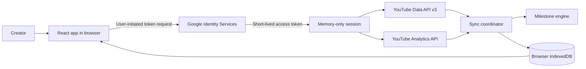
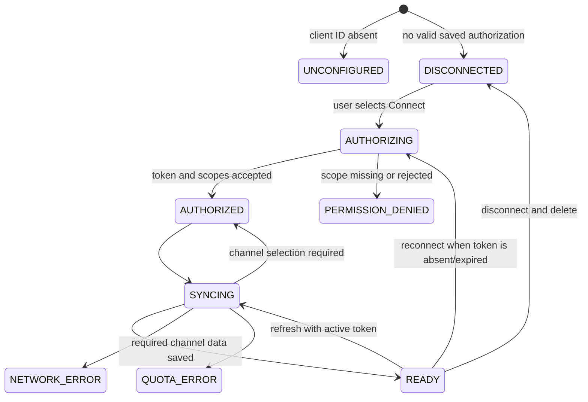
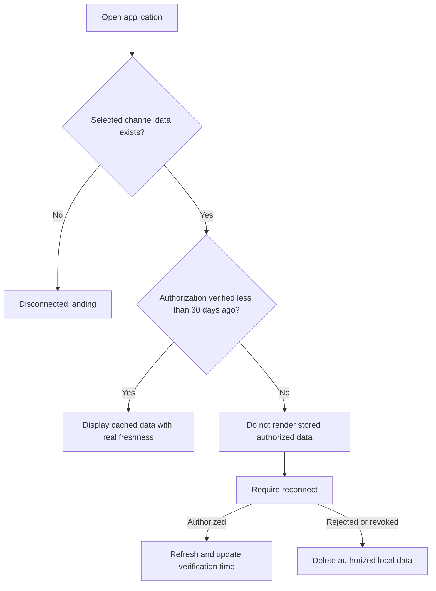
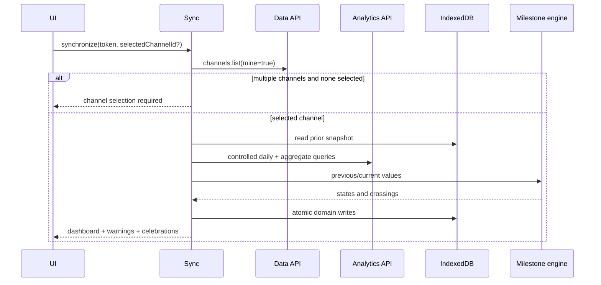

# TubeMilestones Architecture

## System boundary

TubeMilestones is a static browser application. There is no TubeMilestones API server,
database server, account system, or refresh-token service.

The access token is attached as a Bearer header only inside the authorized request
boundary. It is held in a React-owned ref and is never passed through route state,
rendered, logged, or persisted.

## React architecture

`App` composes three top-level concerns:

1. `HashRouter` owns static-host-compatible navigation.
2. `AppProvider` owns the authorization/session state machine and product data.
3. `AppRouter` selects public, loading, channel-selection, or authenticated surfaces.

Home is part of the initial authenticated bundle. Journey, Analytics, and Settings are
route-level lazy imports. Recharts is therefore isolated to the Analytics route chunk.

The provider exposes actions rather than raw database or token objects. Pages can request
connect, refresh, disconnect, theme, goal, and manual-metric operations without gaining
access to credential internals.

## Authorization lifecycle

TubeMilestones uses the Google Identity Services browser token model with exactly these
scopes:

- `https://www.googleapis.com/auth/youtube.readonly`
- `https://www.googleapis.com/auth/yt-analytics.readonly`

Browser access tokens are short-lived and there is no refresh token. Closing or reloading
the tab loses the token. Valid cached data can still render when authorization was
verified less than 30 days ago, but a user gesture is required to obtain a new token and
refresh it.

## Startup and 30-day revalidation

`metadata.authorizationVerifiedAt` is updated only after valid authorized API access.
Startup applies a strict boundary:

This policy applies even though persistence is client-side.

## API boundary

`src/services/google/http.ts` is the common authorized fetch boundary. It provides:

- Bearer-header construction;
- timeouts and optional cancellation;
- JSON handling;
- typed mapping for network, timeout, token, permission, quota, rate, and API errors;
- no token logging.

YouTube clients validate external JSON with Zod. Analytics responses are parsed by column
header name rather than relying on fixed column positions.

## Sync coordinator

The coordinator is the only service that turns an OAuth token into persisted product
state.

Channel data is required. Analytics may fail independently; the coordinator returns a
usable dashboard with a typed warning and the existing Analytics cache where possible.

## IndexedDB

Dexie manages schema version 1:

| Table              | Purpose                                                              |
| ------------------ | -------------------------------------------------------------------- |
| `channels`         | Selected/available channel identity and current API statistics       |
| `channelSnapshots` | Values observed at each successful sync                              |
| `analyticsDaily`   | Header-mapped daily Analytics rows                                   |
| `analyticsSummary` | Aggregate watch minutes, requested dates, and freshness              |
| `milestoneStates`  | Achieved/next states, detection type, and celebration state          |
| `customGoals`      | User-defined metric targets and optional dates                       |
| `manualMetrics`    | User-entered qualified watch hours and Shorts views                  |
| `metadata`         | Selection, tracking start, authorization verification, schema, theme |

The OAuth access token is deliberately absent from the schema.

## Milestone engine

The engine is a pure TypeScript function. It validates, sorts, and deduplicates
definitions, then derives:

- achieved definitions;
- current and next checkpoint;
- crossings since the previous observation;
- progress through the current segment;
- remaining value;
- subscriber precision state.

First-observation achievements are `PREEXISTING` and receive no invented date. Only a
target above the previous value and at or below the current value is a `TRACKED_CROSSING`.
Hidden subscriber values produce no progress result.

## Data provenance

| UI concept                                    | Source                                                          |
| --------------------------------------------- | --------------------------------------------------------------- |
| Channel subscribers, views, uploads           | YouTube Data API                                                |
| Daily views and net subscribers               | YouTube Analytics API                                           |
| Analytics watch time                          | YouTube Analytics `estimatedMinutesWatched`, converted to hours |
| Qualified public watch hours and Shorts views | User entered from YouTube Studio                                |
| Milestone detection dates                     | Local comparison between successful snapshots                   |
| Custom target date                            | User entered, never predicted                                   |

## Deletion

Disconnect follows this order:

1. attempt Google token revocation when a live token exists;
2. clear the access token from memory;
3. delete channel, snapshot, Analytics, milestone, goal, and manual-metric tables;
4. clear selected channel, tracking, and authorization metadata;
5. retain only the non-authorized theme preference;
6. return to the public landing state.

Clear Local Data performs steps 3 through 6. Google permission is managed separately and
the UI links to the Google Account permissions page.

## Routing and deployment

Routes are `#/`, `#/journey`, `#/analytics`, and `#/settings`. Hash routing avoids server
rewrite requirements on GitHub Pages. Vite uses a relative asset base, so the same build
works at `/TubeMilestones/` and a future custom-domain root.

The Pages workflow builds `dist`, uploads only that directory as a Pages artifact, and
deploys through GitHub's `github-pages` environment. See `docs/DEPLOYMENT.md`.
